# GiinScore ユーザーガイド

国会議員の活動を可視化するダッシュボード「GiinScore」の画面別操作ガイドです。

---

## 目次

1. [共通UI](#1-共通ui)
2. [ランキング（ホーム）](#2-ランキングホーム)
3. [議員一覧](#3-議員一覧)
4. [議員詳細](#4-議員詳細)
5. [政党別統計](#5-政党別統計)
6. [議員比較](#6-議員比較)
7. [質問品質ランキング](#7-質問品質ランキング)
8. [お気に入り](#8-お気に入り)
9. [法案一覧](#9-法案一覧)
10. [法案詳細](#10-法案詳細)
11. [スコアについて](#11-スコアについて)
12. [モバイル対応](#12-モバイル対応)
13. [ダークモード](#13-ダークモード)

---

## 1. 共通UI

### ヘッダーナビゲーション

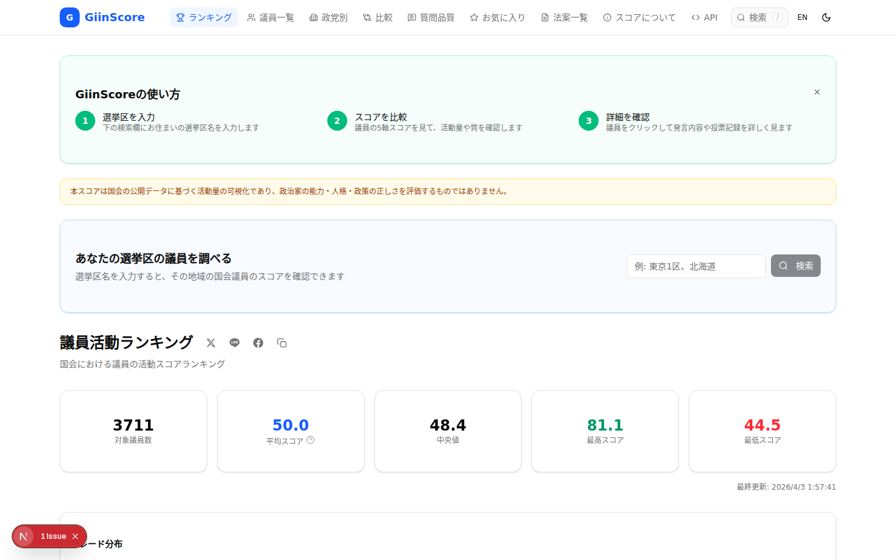

画面上部のヘッダーは全ページで共通です。

| 要素 | 説明 |
|------|------|
| **ロゴ (G GiinScore)** | クリックでホーム（ランキング）に戻る |
| **ナビリンク** | 各ページへのアイコン付きリンク。現在のページは青色ハイライト |
| **検索 (/ キー)** | 議員名のクイック検索。`/` キーでフォーカス可能 |
| **EN** | 日本語 / 英語の言語切り替え |
| **月/太陽アイコン** | ライトモード / ダークモードの切り替え |

**キーボードショートカット:**
- `/` : 検索ボックスにフォーカス
- `Esc` : 検索を閉じる

### スクロール体験

- **プログレスバー**: ページ上部に青色の進捗バーが表示され、現在の読了位置を示します
- **トップに戻るボタン**: 400px以上スクロールすると、画面左下にボタンが出現します

### フッター

フッターには各ページへのリンク、データソースへのリンク、最終更新日時が表示されます。

---

## 2. ランキング（ホーム）

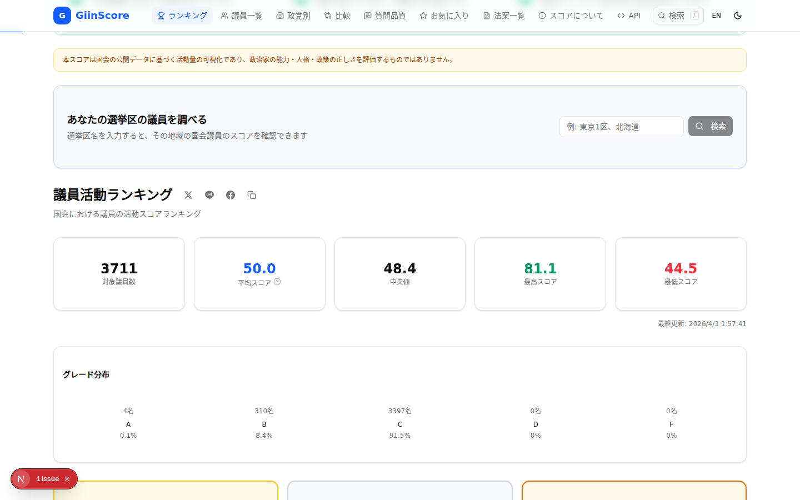

ホーム画面では議員の活動スコアランキングを表示します。

### 使い方ガイド

初回訪問時に表示されるオンボーディングカードで、サービスの基本的な使い方を3ステップで案内します。「×」で閉じると次回以降は表示されません。

### 選挙区検索

「あなたの選挙区の議員を調べる」セクションに選挙区名（例: 東京1区、北海道）を入力すると、該当地域の議員を検索できます。

### 統計サマリーカード

画面中央の5つのカードには、ページ表示時にカウントアップアニメーションで統計値が表示されます。

| カード | 説明 |
|--------|------|
| **対象議員数** | 評価対象の全議員数 |
| **平均スコア** | 全議員のスコア平均値 |
| **中央値** | スコアの中央値（50に近いほど正規分布） |
| **最高スコア** | 現在の最高スコア（緑色） |
| **最低スコア** | 現在の最低スコア（赤色） |

### フィルタ・ソート

| 操作 | 説明 |
|------|------|
| **会期選択** | プルダウンで過去の国会会期を選択 |
| **院選択** | 衆議院 / 参議院でフィルタ |
| **政党選択** | 特定の政党でフィルタ |
| **ソート項目** | 総合 / 立法 / 投票 / 影響 / 透明 / 質問 の各軸でソート |
| **昇順/降順** | ソート順の切り替え |

### TOP3ハイライト

降順表示時に上位3名が金・銀・銅のメダル付きカードで強調表示されます。各カードの5軸バーはアニメーションで伸びます。

### ランキングテーブル

順位・議員名・政党・院・グレード・総合スコア・5軸スコアを一覧表示。議員名クリックで詳細ページへ遷移します。

### 機能ナビゲーションカード

ページ下部の4枚のカードから、質問品質ランキング・政党別統計・散布図分析・法案一覧に素早くアクセスできます。

---

## 3. 議員一覧

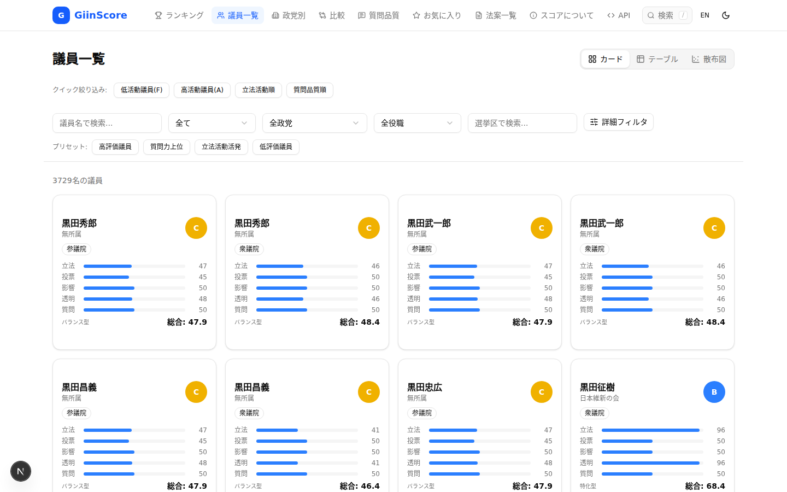

全議員を検索・フィルタして閲覧するページです。

### ビュー切り替え

画面右上の3つのタブで表示モードを切り替えられます。

#### カードビュー

デフォルトの表示モード。各議員がカード形式で表示され、以下の情報が一覧できます:
- 議員名・政党・院
- グレードバッジ（A〜F）— ホバーで拡大アニメーション
- 5軸スコアバー（立法・投票・影響・透明・質問）
- 議員タイプ（バランス型・特化型など）
- 総合スコア

カードにマウスを乗せると、浮き上がるホバーエフェクトが適用されます。

#### テーブルビュー

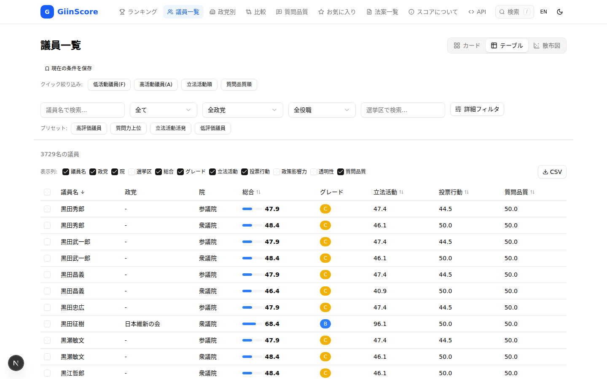

スプレッドシート風の一覧表示。列ヘッダークリックでソートが可能です。デスクトップでは全列が表示され、画面幅に応じて一部列が非表示になります。

#### 散布図ビュー

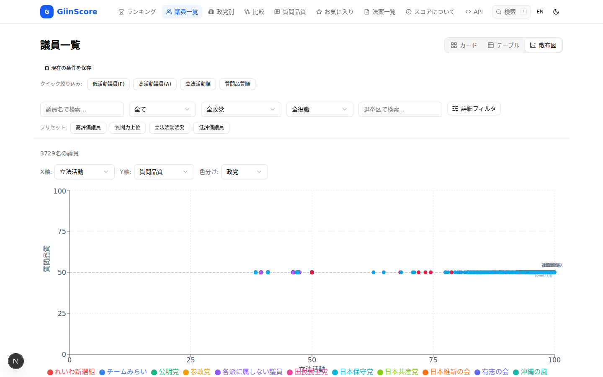

任意の2軸を選んで議員をプロット分析するモードです。

| 設定項目 | 説明 |
|----------|------|
| **X軸** | 横軸に使うスコア軸（立法活動、投票行動、政策影響力、透明性、質問品質） |
| **Y軸** | 縦軸に使うスコア軸 |
| **色分け** | 政党 / 院 / グレードで色分け |

回帰直線と相関係数（R値）が自動計算されます。ドットにマウスを乗せると議員名とスコアが表示されます。

### フィルタ機能

フィルタバーはスクロール時にページ上部に固定（スティッキー）されるため、長いリストでも常にフィルタ操作が可能です。

#### 基本フィルタ

| フィルタ | 説明 |
|----------|------|
| **議員名検索** | 名前の一部を入力するとサジェストが表示される |
| **院** | 全て / 衆議院 / 参議院 |
| **政党** | 動的に取得された政党一覧から選択 |
| **役職** | 閣僚 / 与党幹部 / 野党幹部 など |
| **選挙区検索** | 選挙区名の部分一致検索 |

#### クイック絞り込み

ページ上部のボタンで素早く絞り込めます:
- **低活動議員(F)** — グレードFの議員
- **高活動議員(A)** — グレードAの議員
- **立法活動順** — 立法活動スコアで降順ソート
- **質問品質順** — 質問品質スコアで降順ソート

#### プリセット

「プリセット:」行のボタンで定義済みのフィルタ組み合わせを一括適用できます:
- 高評価議員 / 質問力上位 / 立法活動活発 / 低評価議員

#### 詳細フィルタ

「詳細フィルタ」ボタンを押すと展開されるパネル:
- **グレード**: A〜Fのチェックボックスで複数選択
- **総合スコア**: 0〜100のレンジスライダー
- **5軸個別レンジ**: 各軸のスコア範囲を指定

---

## 4. 議員詳細

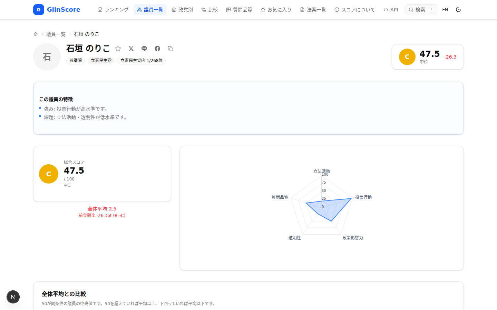

個別の議員の詳細情報を表示するページです。パンくずリスト（ホーム > 議員一覧 > 議員名）で現在位置を確認できます。

### ヘッダー情報

| 要素 | 説明 |
|------|------|
| **アバター** | 議員名の頭文字を表示 |
| **名前・読み仮名** | 議員のフルネームと読み |
| **バッジ** | 院（衆議院/参議院）・政党・選挙区・党内順位 |
| **お気に入りボタン (☆)** | クリックでお気に入りに追加/解除 |
| **シェアボタン** | X・LINE・Facebook・クリップボードへの共有 |
| **グレード・スコア** | 右上に大きくグレードバッジとスコアを表示。前会期比の差分も表示 |

### この議員の特徴

AIが自動生成した議員の強み・課題の要約テキストが表示されます。

### スコアセクション

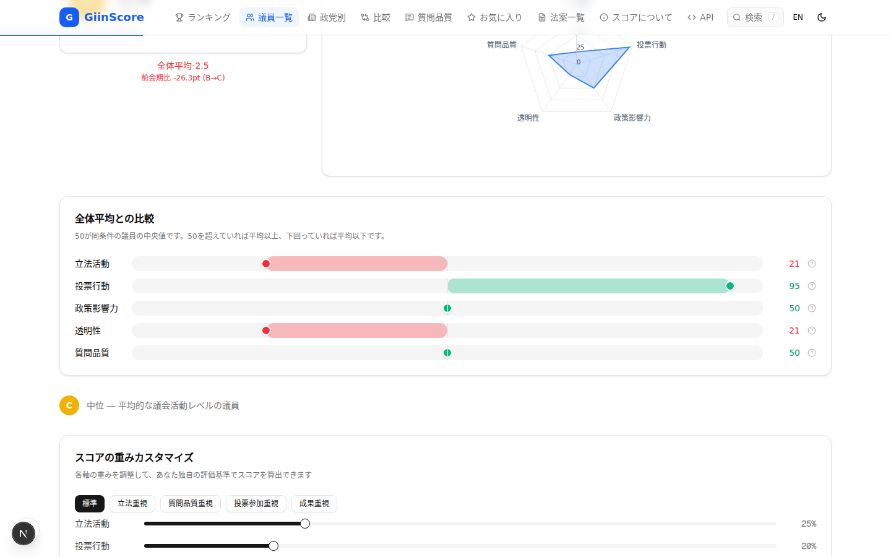

| セクション | 説明 |
|------------|------|
| **総合スコア** | グレードバッジ付きの総合スコアと「全体平均との差」「前会期比」の表示 |
| **レーダーチャート** | 5軸のスコアをレーダーチャートで可視化 |
| **全体平均との比較** | 各軸のスコアが全体平均（50）と比べて上か下かをバーで表示。赤が平均以下、緑が平均以上 |
| **重みカスタマイズ** | 5軸の重みスライダーを調整して独自のスコアを算出。プリセット（標準・立法重視・質問品質重視・投票参加重視・成果重視）あり |

### タブセクション

| タブ | 内容 |
|------|------|
| **発言記録** | 国会での発言一覧。委員会名・日付・発言文を表示。ページネーション付き |
| **投票記録** | 各法案への投票（賛成/反対/欠席）履歴。投票パターン分析（賛成率・欠席率・造反率）付き |
| **質問品質** | AI分析による発言品質スコア。政策的関連性・建設性・専門性・国益貢献度の4軸 |
| **質問主意書** | 提出した質問主意書の一覧。答弁書リンク付き |
| **スコア履歴** | 会期ごとのスコア推移を折れ線グラフで表示。グレード帯の色分けバックグラウンド付き |
| **レビュー** | ユーザーによる5軸評価とコメント。いいね機能付き |

### 関連情報

- **同じ選挙区の議員**: 同一選挙区の他の議員カードを表示
- **類似議員**: スコアパターンが似た議員を最大6名表示

---

## 5. 政党別統計

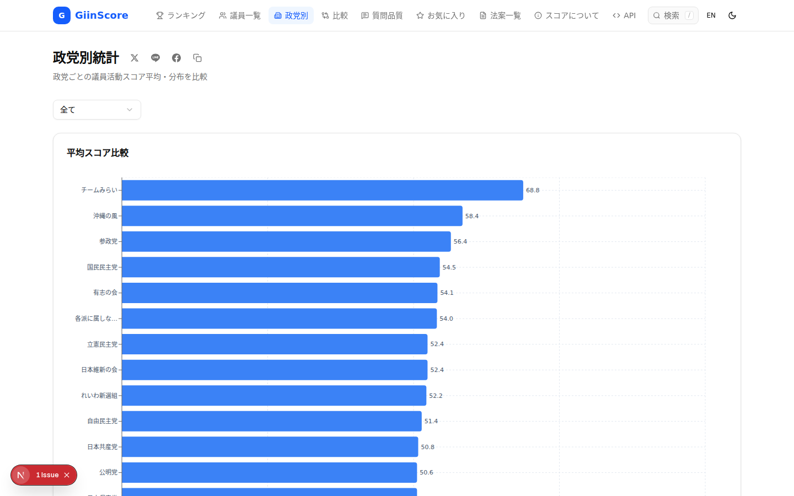

政党ごとの議員活動スコアを集計・比較するページです。

### 平均スコア比較

横棒グラフで全政党の平均スコアを降順表示。マウスオーバーで正確な数値がツールチップに表示されます。

### 表示オプション

| 操作 | 説明 |
|------|------|
| **院フィルタ** | 全て / 衆議院 / 参議院 |

### その他のセクション

- **グレード分布**: 政党ごとのA〜Fグレードの構成比率を積み上げ棒グラフで表示
- **5軸平均比較**: 各政党の5軸スコア平均をテーブルで比較
- **トレンド**: 会期ごとの政党別スコア推移を折れ線グラフで表示

---

## 6. 議員比較

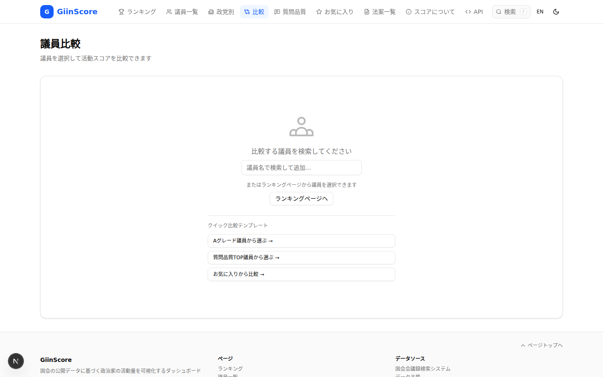

最大4名の議員を選んでスコアを並列比較するページです。

### 議員の追加方法

1. **検索フォーム**: 議員名を入力してサジェストから選択
2. **ランキングページ**: ランキングや議員一覧から「比較に追加」ボタンを使用
3. **クイック比較テンプレート**: 以下のプリセットから選択
   - Aグレード議員から選ぶ
   - 質問品質TOP議員から選ぶ
   - お気に入りから比較

### 比較表示

議員を追加すると以下が表示されます:
- **レーダーチャート**: 選択した議員のスコアを重ね合わせ表示
- **スコアバー**: 各軸のスコアを横棒で並列比較
- **詳細テーブル**: 数値での比較表

選択した議員はlocalStorageに保存されるため、ブラウザを閉じても維持されます。

---

## 7. 質問品質ランキング

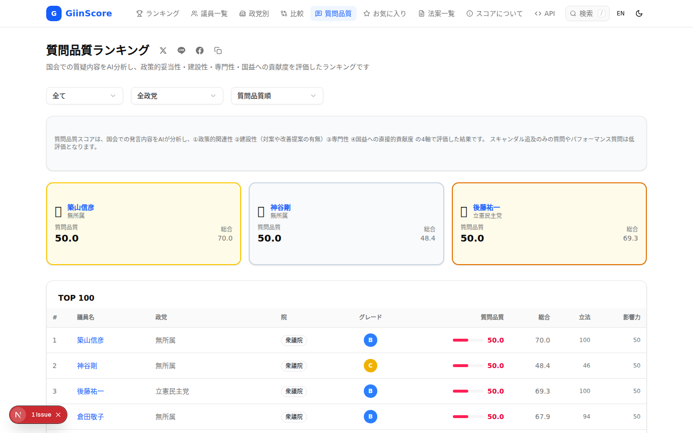

国会での質疑内容をAI（Claude Haiku）が分析し、質問の生産性を評価したランキングです。

### 評価の4軸

| 軸 | 説明 |
|----|------|
| **政策的関連性** | 法案・予算・制度に直接関わる質問か |
| **建設性** | 具体的な改善提案を伴っているか |
| **専門性** | 独自の調査・データに基づいているか |
| **国益貢献度** | 国民生活・経済・安全保障に直結するか |

### TOP3ハイライト

上位3名がカード形式で強調表示されます。金枠（1位）・銀枠（2位）・銅枠（3位）で区別されます。

### TOP100テーブル

順位・議員名・政党・院・グレード・質問品質スコア・総合スコア・立法・影響力を一覧表示。議員名クリックで詳細ページへ。

### フィルタ

- **院**: 衆議院 / 参議院
- **政党**: 特定政党でフィルタ
- **ソート順**: 質問品質順 / 総合順

---

## 8. お気に入り

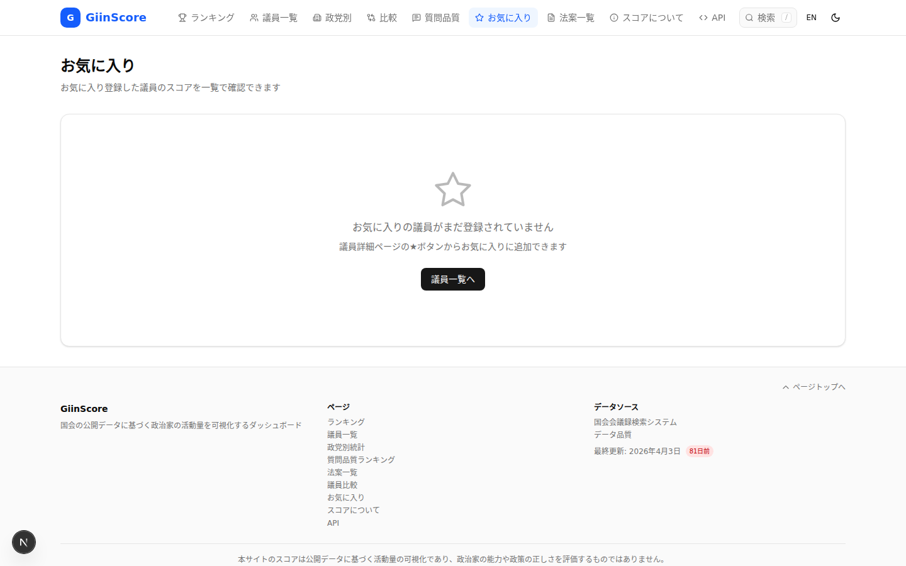

お気に入りに登録した議員をまとめて閲覧するページです。

### 議員の追加方法

各ページの議員名横にある **☆ボタン** をクリックしてお気に入りに追加します。

### 機能

| 操作 | 説明 |
|------|------|
| **一覧表示** | お気に入り議員のカード一覧 |
| **CSV出力** | お気に入り議員のスコアデータをCSVでダウンロード |
| **比較に追加** | 選択した議員を比較ページに送る |
| **解除** | ☆ボタンを再クリックで解除 |

お気に入りデータはブラウザのlocalStorageに保存されます（アカウント不要）。

---

## 9. 法案一覧

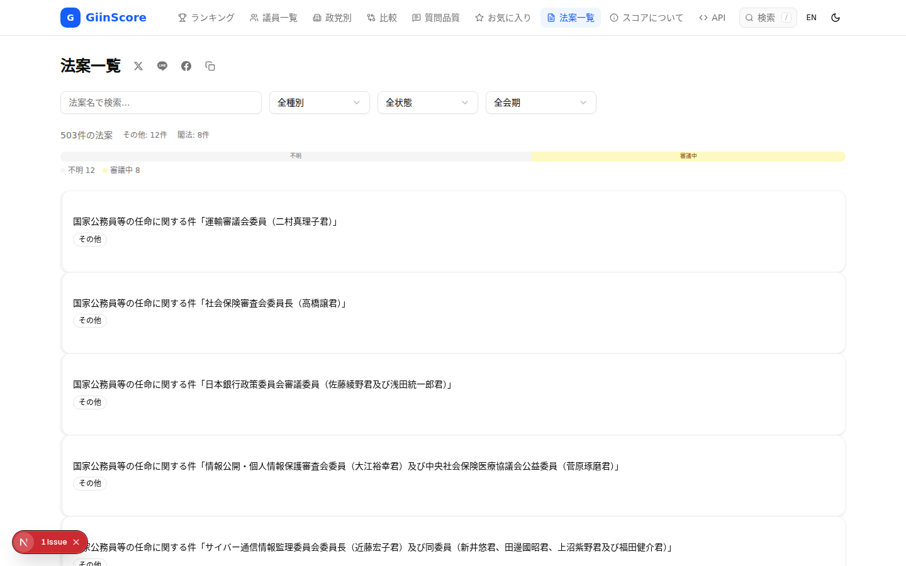

国会に提出された法案を検索・閲覧するページです。

### フィルタ

| フィルタ | 説明 |
|----------|------|
| **法案名検索** | 法案タイトルの部分一致検索。一致部分が黄色ハイライトされる |
| **種別** | 閣法（政府提出）/ 衆法 / 参法（議員提出） |
| **状態** | 成立 / 審議中 / 否決 / 未定 など |
| **会期** | 国会の会期番号でフィルタ |

### 法案カード

各カードに以下の情報が表示されます:
- **左端の色バー**: 種別を示す（青=閣法、紫=衆法、琥珀=参法）
- **タイトル**: 法案名（検索時はキーワードがハイライト）
- **ステータスバッジ**: 審議状態
- **番号・提出者種別**: 第○号、内閣提出/議員提出

### ステータス分布バー

フィルタ結果全体の状態分布を横棒で表示します。

---

## 10. 法案詳細

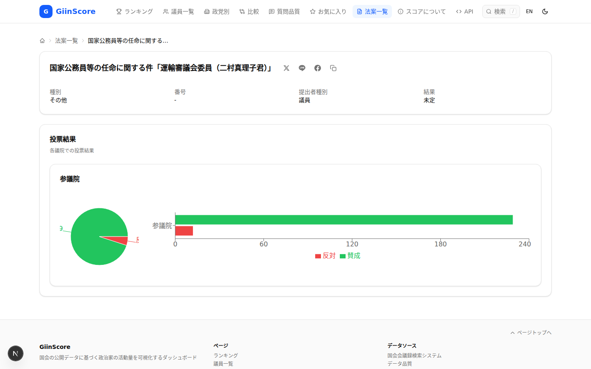

個別の法案の詳細情報を表示するページです。パンくずリスト（ホーム > 法案一覧 > 法案名）付き。

### 表示内容

| セクション | 説明 |
|------------|------|
| **基本情報** | 種別・番号・提出者種別・結果 |
| **ステータスバッジ** | 法案の審議状態 |
| **投票結果** | 各議院での賛成/反対の内訳を円グラフと横棒グラフで表示 |
| **シェアボタン** | SNSシェア機能 |

---

## 11. スコアについて

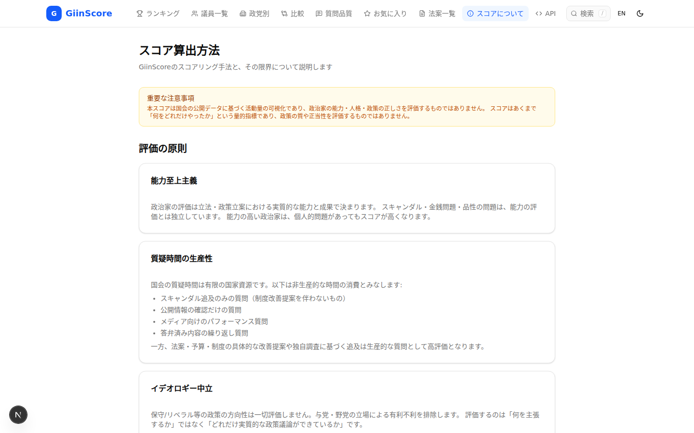

GiinScoreのスコアリング手法と評価の原則を説明するページです。

### 掲載内容

- **重要な注意事項**: 本スコアが政治家の能力・人格・政策の正しさを評価するものではないことの明示
- **評価の原則**:
  - **能力至上主義**: スキャンダルではなく立法・政策立案の実質的成果で評価
  - **質疑時間の生産性**: 非生産的な質問（スキャンダル追及のみ、パフォーマンス質問等）の定義
  - **イデオロギー中立**: 保守/リベラル等の政策方向性は評価しない
- **スコアリングモデル**: 5軸の重みと算出方法
- **データソース**: 国会会議録検索システム等の公開データ

---

## 12. モバイル対応

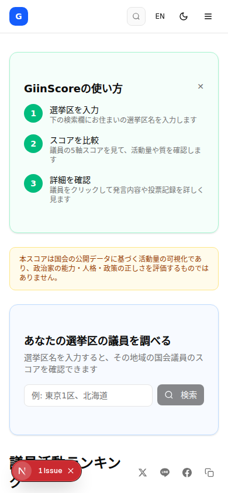

全ページがレスポンシブデザインに対応しています。

### モバイル版の特徴

| 要素 | モバイル版の挙動 |
|------|------------------|
| **ナビゲーション** | ハンバーガーメニュー（≡）からサイドシートで表示。アイコン付きで視認性向上 |
| **カードグリッド** | 1列表示に切り替わる |
| **テーブル** | 横スクロール対応。一部列が非表示 |
| **フィルタ** | 縦並びに自動レイアウト |
| **グラフ** | 画面幅に合わせてリサイズ |
| **検索** | コンパクトなアイコン表示 |

---

## 13. ダークモード

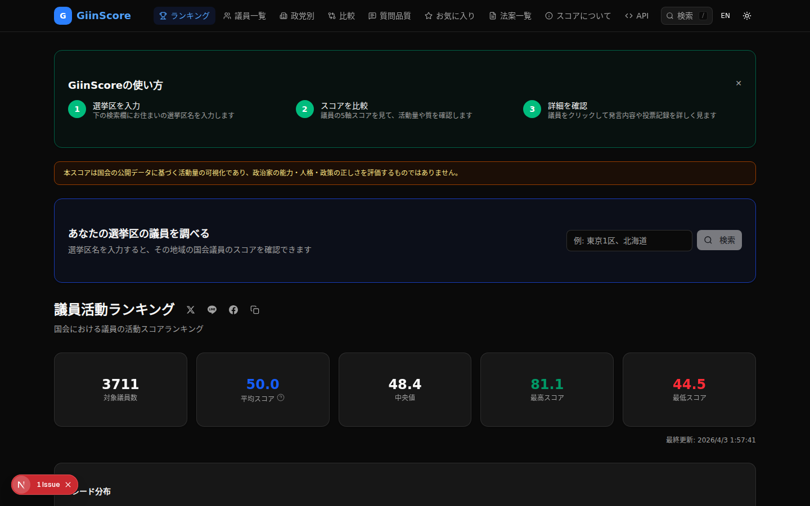

ヘッダー右上の月/太陽アイコンでダークモードに切り替えられます。

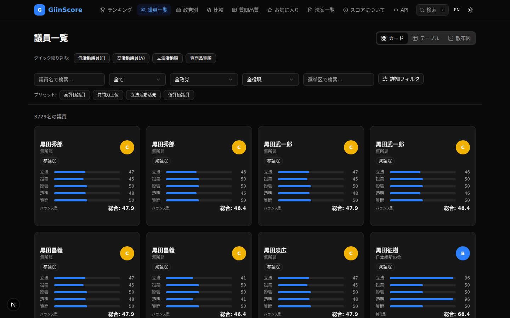

### 対応状況

- 全ページ・全コンポーネントがダークモードに対応
- グラフ（レーダーチャート、棒グラフ、折れ線グラフ等）もダーク配色に自動切替
- OSのダークモード設定に自動追従（初回のみ）
- ユーザー設定はlocalStorageに保存

---

## 付録: グレード一覧

| グレード | スコア範囲 | 色 | 意味 |
|----------|-----------|-----|------|
| **A** | 80〜100 | 緑 | 非常に高い活動レベル |
| **B** | 60〜79 | 青 | 平均以上の活動レベル |
| **C** | 40〜59 | 黄 | 平均的な活動レベル |
| **D** | 20〜39 | 橙 | 平均以下の活動レベル |
| **F** | 0〜19 | 赤 | 非常に低い活動レベル |

## 付録: 5軸スコアの説明

| 軸 | 重み | 評価対象 |
|----|------|----------|
| **立法活動** | 25% | 法案提出数・共同提出数・質問主意書提出数 |
| **投票行動** | 20% | 本会議投票への出席率 |
| **政策影響力** | 20% | 法案の成立数・委員会での発言頻度 |
| **透明性** | 15% | 資産公開・活動報告の積極性 |
| **質問品質** | 20% | AI分析による国会質疑の生産性評価 |
